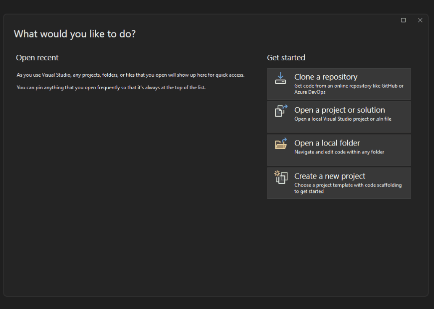

# Create an app

This section will guide you through the process of creating a new app using the Uno Platform Figma Plugin and the _Example App_ present by default in the [Uno Platform Material Toolkit](https://aka.platform.uno/uno-figma-material-toolkit) file, using the [Uno Platform Figma Plugin](https://aka.platform.uno/uno-figma-plugin).

> [!IMPORTANT]
> This page is assuming that the [Design to Code](design-to-code.md) section has been completed.

## Development environment (Visual Studio or your favorite IDE)

Creating a new project using the Uno Platform requires a developer environment to be setup. The following guides will help setting up a development environment:
[Get Started with Uno Platform](xref:Uno.GetStarted)

## Create a project

This simple tutorial will create a new project using the `unoapp` template. It's using the blank template augmented with Uno Material and Uno Toolkit using the XAML UI language.

### [dotnet new](#tab/dotnet-cli)

Run the following command in a terminal to create a new project:
```shell
dotnet new unoapp -preset blank -toolkit true -theme material -o MyFirstAppFromFigma
```

### [Visual Studio](#tab/visual-studio)

1. Open Visual Studio
2. Select _Create a new project_
3. Search for _Uno Platform App_ in the search box and select it
4. Click _Next_
5. Fill the project name (name it `MyFirstAppFromFigma` to fit the rest of this tutorial)
6. Click _Create_
7. The _Uno Platform Template Wizard_ will open
8. Select the _Blank_ template and click _Customize_
9. Go in the _Theme_ section and select _Material_
10. Go in the _Features_ section and select _Toolkit_
11. Click _Create_



---

Following steps will use Visual Studio, but any other IDE should work as well with minimal changes.

## Step 1 - Open the solution, compile and run it
1. Open the generated `MyFirstAppFromFigma.sln` solution in your favorite IDE
2. In the top toolbar, select the platform you like as your startup project (following screenshots will use `MyFirstAppFromFigma.Windows`)
3. Press F5 to run the app and ensure it builds correctly
4. Locate the page `MainPage.xaml` in the `MyFirstAppFromFigma` library project
5. Compile the project to ensure it builds correctly
6. Switch to Figma (next section)

## Step 2 - Make Figma generates the right XAML
1. Go back to Figma, in the document you created in the [Design to Code](xref:Uno.Figma.GetStarted.DesignToCode) section.
2. Open the plugin (more details in the [Setup](xref:Uno.Figma.GetStarted.Setup) section)
3. In Figma, select the _01. Login_ frame
4. In the plugin, navigate to the _Properties_ tab
5. In the _Page Name_ field, write `MainPage`
6. Navigate to the _Application_ subtab
7. In the _Application Name_ field, write `MyFirstAppFromFigma`
8. Go back to the _Export_ tab
9. Click on the _Refresh_ button
10. Now click on the _Copy_ button to copy the generated XAML to the clipboard

## Step 3 - Paste the generated XAML into app project
1. Go back to your IDE (Visual Studio in this example)
2. Replace the content of the `MainPage.xaml` file with the generated XAML, from the clipboard
3. Press F5 to run the app

## Next steps

This tutorial has shown you how to create a new app using the Uno Platform Figma Plugin and the _Example App_ present in the _Uno Material Toolkit_ Figma document.

Use this documentation to understand how to use the plugin to generate code from your own Figma document.
