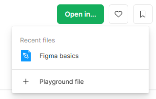
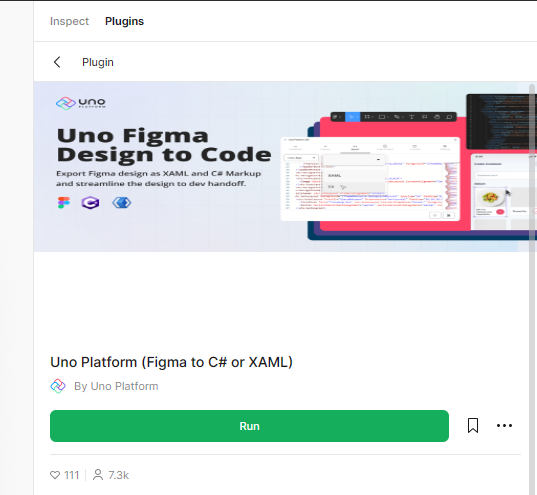
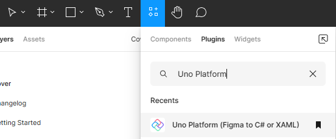
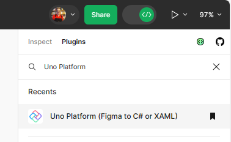

# Getting Ready

This section will guide you through the process of setting you up to use Figma and the Uno Platform Figma Plugin to generate code that can be used to create an app.

Those steps will use the web version of Figma. The plugin is also available in the desktop version of Figma and the steps are pretty similar.

## Figma environment
Let's start by making sure you have a working Figma environment.

1. Navigate to [Figma web site](https://figma.com/)
2. Sing-in or [create a new account](https://help.figma.com/hc/en-us/articles/360039811114-Create-a-Figma-account) if you don't have one already
3. Navigate to the [Uno Figma Plugin page](https://aka.platform.uno/uno-figma-plugin)
4. Click on the _Open in..._ button and pick `+ Playground file` option to create a new copy of the _Uno Material Toolkit_ document

   
5. Figma should launch be default in _developer mode_ (see below if it doesn't)
6. Click on the _Run_ button to launch the plugin

   
7. Your Figma is now ready to start generating code

> [!NOTE]
> There is many ways to launch the plugin. If the provided method doesn't work for you, you can also:
> * Press <kbd>shift</kbd>+<kbd>d</kbd> to toggle between _developer mode_ and _design mode_
> * In Design mode: use the _plugin_ menu in the toolbar and search for _Uno Platform_
>
>    
> * In Developer mode: use the _Plugins_ tab in the right panel and search for _Uno Platform_
>
>   

## Development environment (Visual Studio or your favorite IDE)

Creating a new project using the Uno Platform requires a developer environment to be setup. The following guides will help you setup your environment:
[Getting Started with Uno Platform](xref:Uno.GetStarted)
This guide will use Visual Studio on Windows as the IDE, but it is possible to use other supported IDEs like Visual Studio Code or JetBrains Rider.

> [!IMPORTANT]
> Ensure you have a working development environment before continuing.
> Follow the [Uno Platform Getting Started](xref:Uno.GetStarted) guide.
> 

## Next step

Start generating code from a Figma document by following the [Design to Code](design-to-code.md) guide.