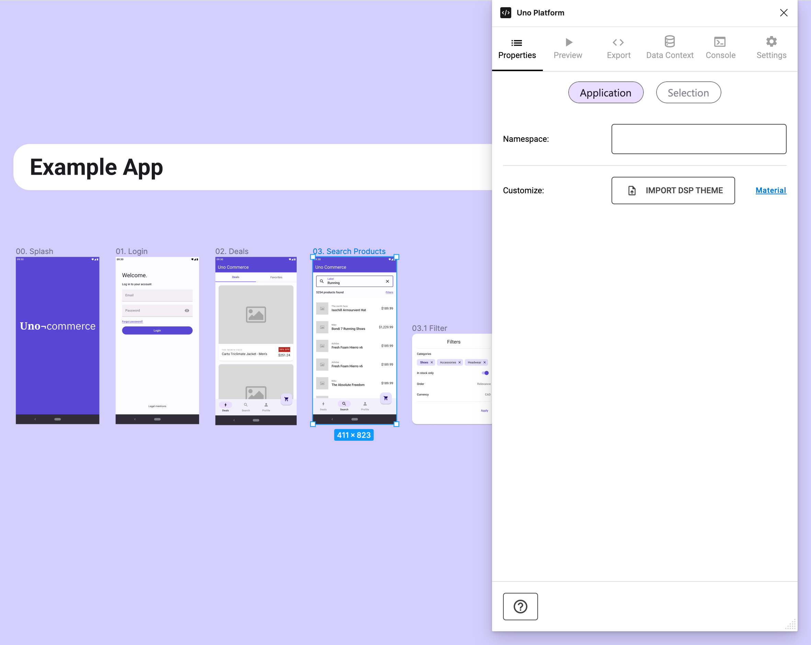
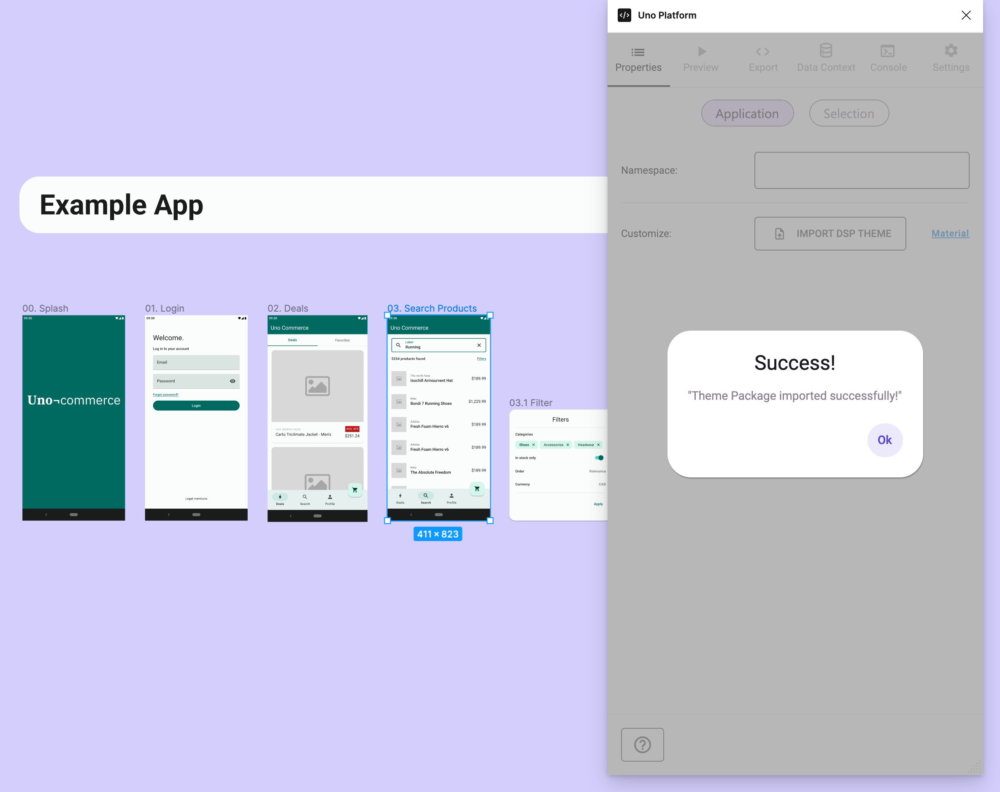

# Importing a DSP color theme 

Supports DSP files from the web version of the Material Theme Builder

## What is DSP, and why use it?

Design System Package (DSP) is an "*open-format folder-structure created to help teams share design system information across tools.*".

The Uno plugin for Figma allows you to import a DSP file generated from the online version of the [Material Theme Builder](https://m3.material.io/theme-builder#/custom) . This gives you a shortcut to exploring and applying different color themes for your app design. Once imported into the Uno Figma Toolkit all of it's components will update to follow your new color theme saving you time and effort.

We recommend you do this at the start of the design phase but you can apply a new theme to your design at any point in the design cycle.  

## How to import the DSP file 

1) Generate your color theme from the [Material Theme Builder](https://m3.material.io/theme-builder#/custom);
2) Click the *Export* button in the top right area of the website and make sure to select **Material Tokens (DSP)** from the drop down menu;
3) From the [Uno Figma Toolkit file](https://www.figma.com/community/file/1110792522046146058) select a page from your design and launch the [Uno Figma plugin](https://www.figma.com/community/plugin/1045528009520465828);
4) Go to the *Poperties* Tab then select *Application* and click *Import DSP Theme*;
5) From the file picker window navigate to the location of the *material-theme.zip* file you exported in step 2 (no need to unzip the file).

> [!IMPORTANT]
> Brushes will not be automatically updated when importing a DSP file make sure to update the brushes in Figma to match the new colors they are based off of.  

## After DSP import

