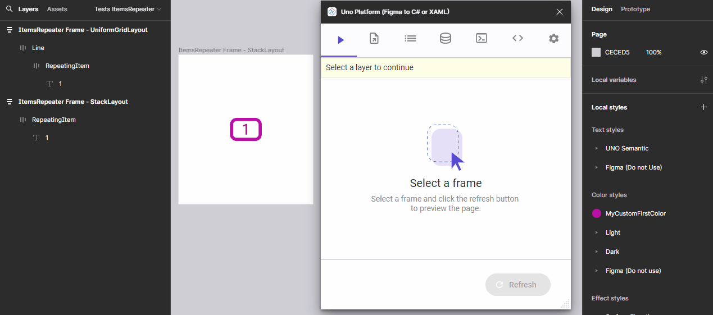
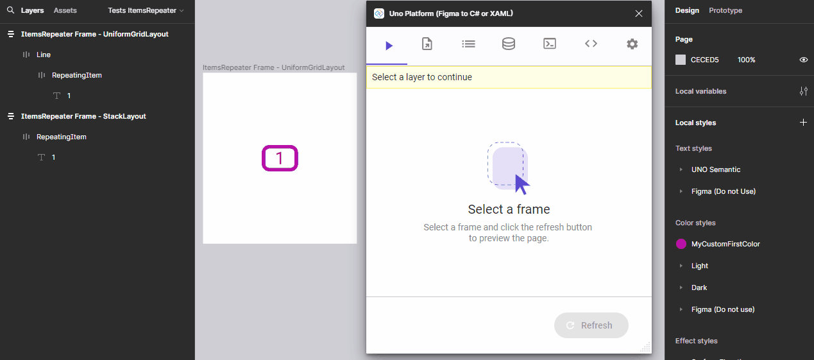
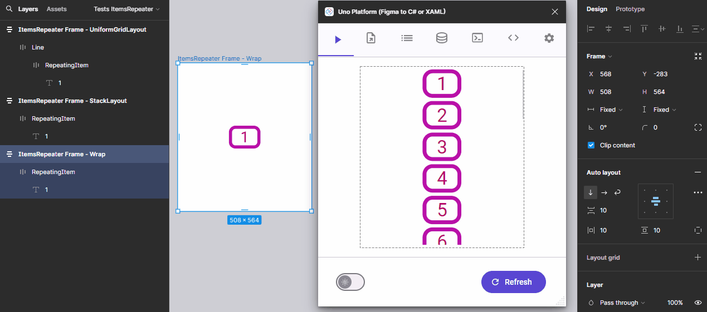
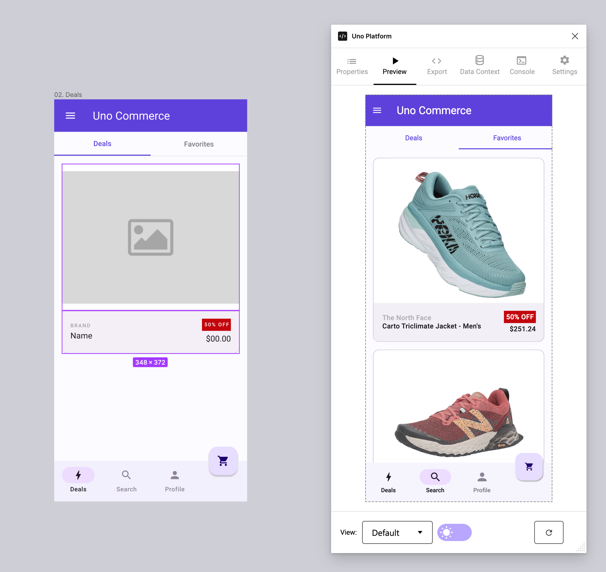

# Maximizing UI Design with ItemsRepeater in Uno Figma

## Understanding the ItemsRepeater

ItemsRepeater is an advanced feature in the Uno Figma Toolkit designed to generate code for displaying collections of items in various layouts, like lists and grids. It's particularly efficient for large datasets, improving app performance by rendering items in a repeating pattern, thereby reducing memory usage. This feature not only benefits developers but also streamlines the design-to-development handoff process.

## Choosing Between UniformGridLayout and StackLayout

- **UniformGridLayout**: Presents items in a uniform-sized grid, ideal for visually organized displays.
- **StackLayout**: Stacks items either horizontally or vertically, based on AutoLayout properties, suitable for linear item arrangements.

## Implementing Scrolling with ItemsRepeater

It's important to note that ItemsRepeater itself doesn't provide scrolling capabilities. To incorporate scrolling, place the ItemsRepeater within a scrollable region. It will then adapt its virtualization to the scroll viewers present.

## Steps to Apply ItemsRepeater in Figma Designs

### 1. **Frame Selection**

- Choose the frame where the repeated items will be displayed.

The plugin offers support for both **UniformGridLayout** or **StackLayout** ItemsRepeater.

**For StackLayout:**
Ensure that the chosen frame directly contains the content that will be repeated. The layout orientation will follow the frame's orientation. To create an ItemsRepeater with StackLayout, add only the repeating content directly to the frame.

Refer to the animation below for a visual guide:




**For UniformGridLayout:**
Follow the steps in the animation to generate an ItemsRepeater using UniformGridLayout.

- The frame should have an intermediate container between the repeating content and itself.
- This intermediate frame dictates the listing orientation. For example, for horizontal listing, the ItemsRepeater frame should have a child AutoLayout oriented horizontally, acting as a line containing the items to repeat.
- For vertical listing, the intermediate AutoLayout should be oriented vertically, acting as a column containing the repeating content.

Refer to the animation below for a visual guide:




> [!NOTE]
> If you add a Wrap Layout mode to an AutoLayout and set it as an ItemsRepeater (StackLayout or UniformGridLayout), it will automatically generate a UniformGridLayout ItemsRepeater horizontally oriented, eliminating the need for an intermediate frame.
> The orientation in a wrapping scenario can be confusing. To make it simpler, it can be considered as the direction that is growing when adding a large quantity of elements. In this case, the orientation of a wrapping AutoLayout in Figma will be VERTICAL, not horizontal!




### 2. **Launch Uno Plugin**

- Open the Uno Figma plugin to begin customization.

### 3. **Configure Properties**

- In the *Properties* Tab, select **ItemsRepeater (UniformGridLayout)** or **ItemsRepeater (StackLayout)** from the *Type* dropdown menu.

### 4. **Setting Up Data Context**

- Navigate to the *Data Context* Tab.
- Enter your data in JSON format to simulate real-world content.
- Save your settings.
- Navigate to the *Properties Tab* Add the Content Expressions to the frames you want to bind

### 5. **Previewing Your Design**

- Use the *Preview* Tab to refresh and see the updated layout.
- The live preview will display the layout populated with data from the Data Context tab.



> [!NOTE]
> The ItemsRepeater doesn't provide states for the repeated items. Data Context is set at the *Root Frame* level in Figma, meaning the data will be associated with the first *root* frame, regardless of the selected element.

### Example of Data Context

Below is an example JSON data, featuring a variety of products:

``` json
{
  "Items": [
    {
      "Name": "Alpine Trek Jacket - Men's",
      "Brand": "Mountain Peak",
      "Photo": "https://nv-assets.azurewebsites.net/tests/commerce/products/product1.png",
      "DiscountedPrice": "$200.99",
      "Discount": "40% OFF"
    },
    {
      "Name": "Velocity Sprinter Shoes",
      "Brand": "RunFast Gear",
      "Photo": "https://nv-assets.azurewebsites.net/tests/commerce/products/product2.png",
      "DiscountedPrice": "$120.49",
      "Discount": "Save 30%"
    },
    {
      "Name": "Eagle Hiker Running Shoes",
      "Brand": "Outdoor Ventures",
      "Photo": "https://nv-assets.azurewebsites.net/tests/commerce/products/product3.png",
      "DiscountedPrice": "$175.00",
      "Discount": "Save 15%"
    },
    {
      "Name": "Rapid Trail Runner",
      "Brand": "TrailMaster",
      "Photo": "https://nv-assets.azurewebsites.net/tests/commerce/products/product4.png",
      "DiscountedPrice": "$89.99",
      "Discount": "Save 20%"
    },
    {
      "Name": "Marathon Elite Sneakers",
      "Brand": "CityGear",
      "Photo": "https://nv-assets.azurewebsites.net/tests/commerce/products/product5.png",
      "DiscountedPrice": "$59.99",
      "Discount": "HOT DEAL"
    }
  ]
}
```
