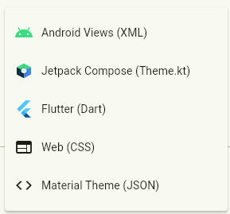

# Color Themes

## Generating Color Themes with Uno Toolkit

To enhance the aesthetic appeal and consistency of your project, the Uno Toolkit offers customizable Light and Dark themes. These can be tailored to meet the specific color requirements of your project. For additional customization or to develop a unique color scheme, the [Material Theme Builder](https://aka.platform.uno/uno-material-themebuilder) is an invaluable tool.

To dynamically switch color themes in your Figma document, the **Atlas Theme Manager Plugin** is recommended. More details about these tools are available on the [Download & Tools](../../download.md) page.

## Creating a Custom Theme File

The Uno Figma Plugin supports importing theme files, allowing for extensive customization of your Figma file. Utilize the [Material Theme Builder](https://aka.platform.uno/uno-material-themebuilder) to craft a personalized theme, which can then be imported into Figma.

### Steps to Generate a Theme File

1. Access the [Material Theme Builder](https://aka.platform.uno/uno-material-themebuilder) online.
2. Customize your theme to fit your project's needs, including the creation of custom colors.
3. When you are done customizing, open the **Export** section of the tool, available by clicking on the top rightmost button:

    

4. In the **Export** section, click on the **Export** button at the bottom of the flyout:

    

5. Be sure to select the **Material Theme (JSON)** option to download your theme in a JSON file format. This step is crucial, as the Uno Plugin requires this specific format for successful import.

    > [!NOTE]
    > At the moment, all font changes in Material Theme Builder do not change the exported JSON file. Font changes are only working for _Jetpack Compose_ and _Flutter_ file exports for now.

    

> [!CAUTION]
> The Material Theme Builder does not currently support re-importing your theme file. To modify your theme, you will need to either start from scratch or maintain the Theme Builder web page for reference.

## Importing a Theme File into Figma

### Steps for Import

1. In Figma, open your file and select the **Uno Plugin** from the Plugins menu.
2. Within the Uno Plugin, navigate to the **Properties Tab**.
3. Click on **Import Theme**, then choose the file you downloaded from the Material Theme Builder. It's essential to use the unaltered file for a smooth import process.
4. Confirm to apply the theme to your Figma file.

> [!NOTE]
> If the imported theme doesn't align with your expectations, use Figma's **Undo** feature to revert all changes at once.

> [!TIP]
> Although the **Material Theme Builder Tool** doesn't export **Material Tokens (DSP)** packages anymore, the Uno Figma Plugin still supports this file format with no restrictions.
> The Uno Plugin will only process relevant files within the theme package, disregarding any unrelated content and notifying you of such instances.
