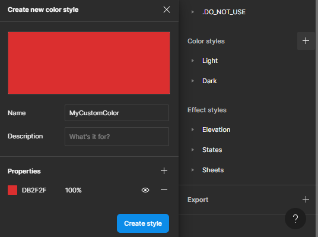
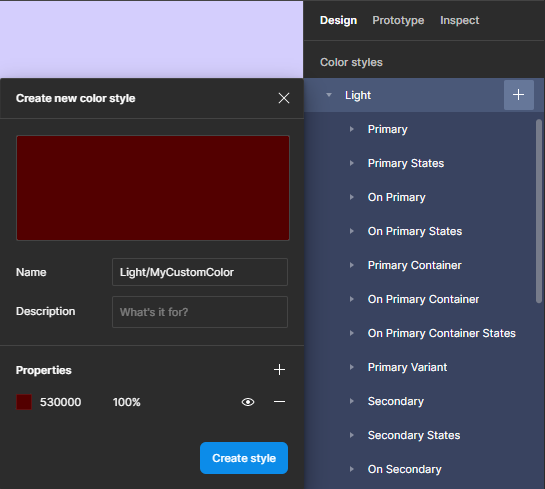
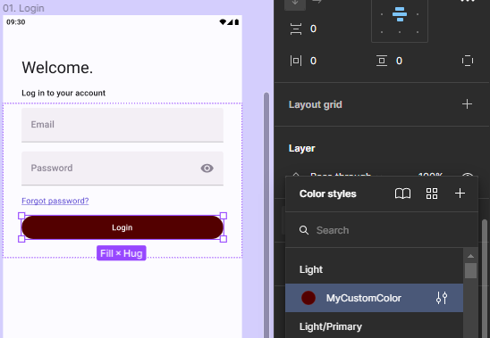
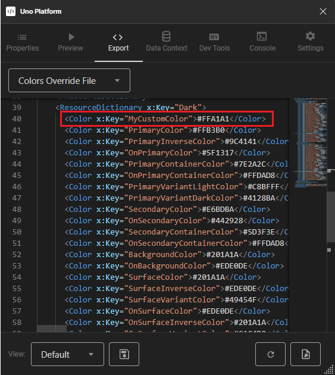

# Custom Colors

## Using Custom Colors

In this guide, you will learn how to create Custom Colors and apply them to Figma elements. Custom Colors allow you to define your own color palette and use it consistently across your designs, ensuring a cohesive look and feel.

By the end of this guide, you will have a solid understanding of how to create and use custom colors in your Figma designs, and be able to export your XAML Resource Dictionary file with all of your custom colors defined.

> [!NOTE]
> To ensure that Custom Colors work properly, it is important to name the color with the suffix "Color". This helps the system recognize the color and apply it correctly to the desired elements.

### Unthemed Custom Color

1. Open the right panel under the Design tab and go to the Color styles section.
2. Click the add (+) button.
3. A popup window will appear. Name your custom color, for example, MyCustomColor. Remember to have the suffix "Color".
4. In the Properties section, select the desired color.
5. Click "Create style" to save your Custom Color.

 

### Themed (Dark/Light) Custom Color

1. Open the right panel under the Design tab and go to the Color styles section.
2. Navigate to the Light tree and hover your mouse over it to reveal an Add button.
3. Click the add (+) button.
4. A popup window will appear. Note that a "Light/" prefix will be added to the Name field. After the slash, add your Custom Color name, for example, Light/MyCustomColor. Remember to have the suffix "Color".
5. In the Properties section, select the desired color.
6. Click "Create style" to save your Custom Color.
7. Repeat the process for the Dark theme.

 

### How to apply your color

1. Open the left panel under the Layers tab and find the element you want to apply the color to. Select it by clicking on it.
2. After selecting the element, open the right panel and click on the currently selected color to reveal a list.
3. Find your Custom Color and select it.

 

### Exporting the colors

1. Open the Uno Figma Plugin.
2. Select your design.
3. Go to the Export tab and find the dropdown menu located in the top left corner.
4. Select "Colors Override File".

 

> [!NOTE]
> If you created an Unthemed Custom Color, your color will appear at the end of the file. If you created a Themed (Dark/Light) Custom Color, you will find them in the respective theme section.

> [!NOTE]
> In order for the Custom Color to function correctly, a `SolidColorBrush` will also be generated at the end of the file. This brush serves as the reference for the custom color and allows it to be applied to the relevant UI elements. Therefore, it is essential to ensure that a SolidColorBrush is included in the file along with the Custom Color definition.