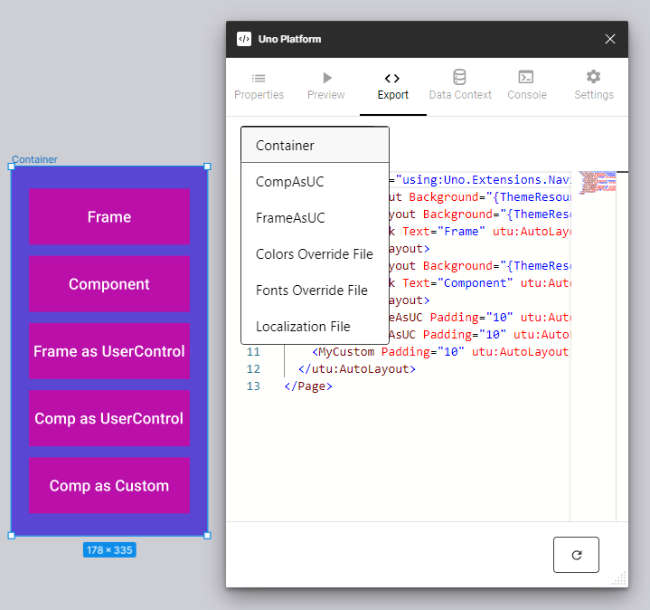
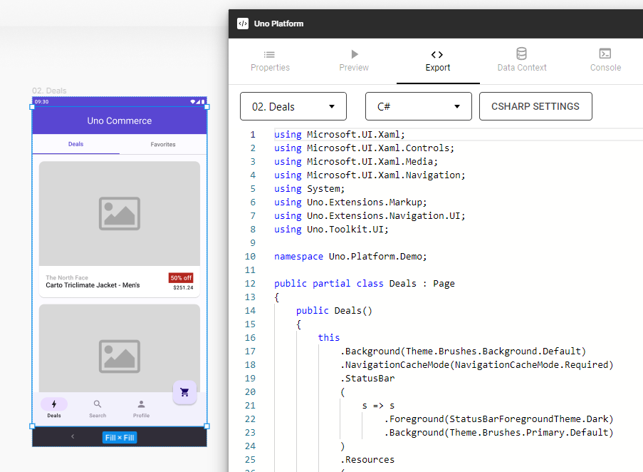
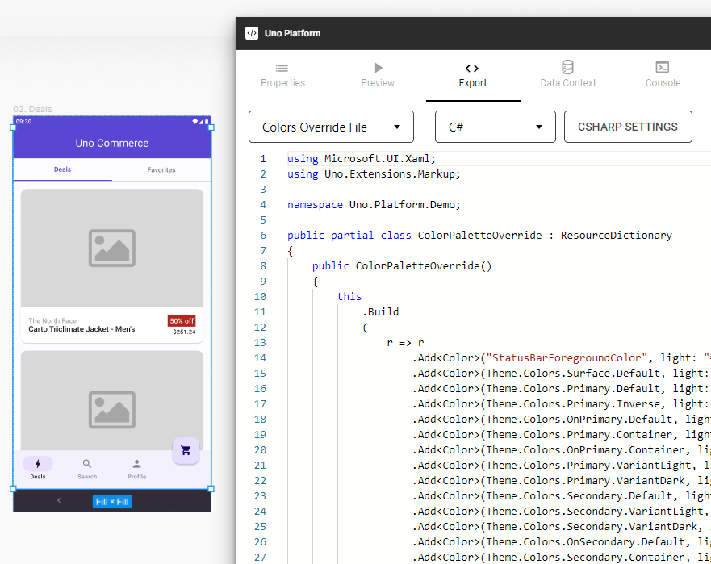

# Export Tab in Uno Figma Plugin

## Utilizing the Export Tab

The Export tab is a powerful tool within the Uno Figma Plugin, offering the ability to inspect generated code and export it for development purposes.

### Features of the Export Tab

- **Code Inspection**: View and analyze the generated code directly within Figma.
- **Format Selection**: Alternate between `Xaml`, `Colors Override File`, `Fonts Override File`, and `Localization File` using the dropdown at the top-left.
- **Export Functionality**: Export the code by copying it to the clipboard, allowing you to paste it into your preferred text editor.

> [!NOTE]
> To ensure proper code generation, it's essential to use the appropriate templates and components. Refer to the [New Design Guidelines](../designers/starting-new-design.md) for starting a new project.

### Steps to Use the Export Tab

1. **Select Item**: Choose the page or component you wish to inspect.
2. **Access Plugin**: Open Uno Platform from Figma's Plugins menu.
3. **Open Export Tab**: Click on the Export tab, the third icon from the left.
4. **Refresh View**: Use the Refresh button at the bottom of the tab to update the view.

## View Hierarchy Feature

The Uno Figma Plugin supports generating reusable code for User Controls, Custom External Controls, Pages, and more. The plugin exports controls with their own code separately and references them in the main container code for a flexible and clean structure.

### Implementing View Hierarchy

1. **Convert to Component**: Transform any frame into a component to generate AutoLayout containers in the code.
2. **Use Properties Tab**: Set the Type field as Page or User Control for dedicated content code and references.
3. **Combine Approaches**: Convert frames into components and set Control Type in the Properties Tab for comprehensive code generation.

## C# Markup Export

The plugin allows the choice between Xaml and C# Markup formats for the exported code.

1. **Select Format**: Choose the desired format in the Export Tab's second dropdown.

   

2. **Export Resource Overrides**: The plugin can also export Resource Overrides in C# Markup.

   

> [!NOTE]
> Specific settings for C# markup can be adjusted using the Csharp Settings button, available when C# is selected.

> [!NOTE]
> To override your application's resources, copy the text into your Override file as outlined in the [Uno Themes documentation / Colors override](https://aka.platform.uno/uno-material-colors).

> [!WARNING]
> The Export features are fully functional only if the document is created by duplicating the [Uno Toolkit](../designers/starting-new-design.md) document.
