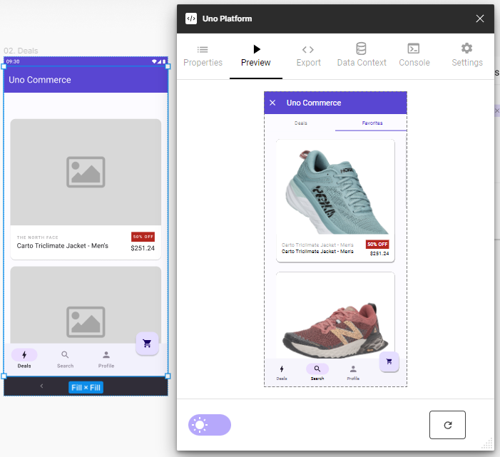

# Preview Tab in Uno Figma Plugin: A Comprehensive Guide

## Enhancing Design with the Preview Tab

The Preview Tab in the Uno Figma Plugin is a crucial tool for designers and developers, offering a true-to-life simulation of how designs will be realized in the final application.

### Core Features of the Preview Tab

- **Dynamic Interaction**: Enables engagement with design elements, such as typing in text inputs, pressing buttons, and scrolling.
- **Realistic Data Binding**: Utilize [mock data (DataContext)](datacontext-tab.md) for testing designs and observing dynamic data binding.
- **High Fidelity Rendering**: Employs Uno Platform directly for an accurate representation of elements in the actual application.
- **Uno Platform Wasm Development**: The plugin is crafted using Uno Platform (Wasm platform), enhancing rendering accuracy.
- **Design Guidelines Adherence**: Follow [New Design Guidelines](../designers/starting-new-design.md) to ensure precise rendering.
- **Refresh Capability**: Features a refresh control at the bottom of the tab for updating the view.
- **Toggle Between Modes**: Includes a toggle switch to alternate between dark and light modes, allowing for versatile theme testing.

### Limitations

- Navigation click-through interactions are not supported.
- Some primitive shapes are not fully unsupported in the preview.

### Utilizing the Preview Tab Effectively

1. **Item Selection**: Pick the page or component in Figma you wish to preview.
2. **Plugin Access**: Open the Uno Platform Plugin from Figma's Plugins menu.
3. **Enter Preview Tab**: Click on the Preview tab, the second icon from the left.
4. **Refresh for Current View**: Use the Refresh button for the latest updates.
5. **Mode Exploration**: Use the toggle switch at the bottom to switch between dark and light modes, enhancing your view of the design under various conditions.

   

### The Preview Tab

The Preview Tab is instrumental in closing the gap between conceptual design and practical application development. It offers an authentic view of UI elements in real application settings, making it an invaluable tool for early detection of design issues and ensuring the final product aligns with the envisioned design.

Integrating the Preview Tab into the workflow enhances the accuracy and efficiency of the design-to-development process, ensuring that the final application is not only visually appealing but also functionally sound, mirroring the Uno Platform's capabilities.
