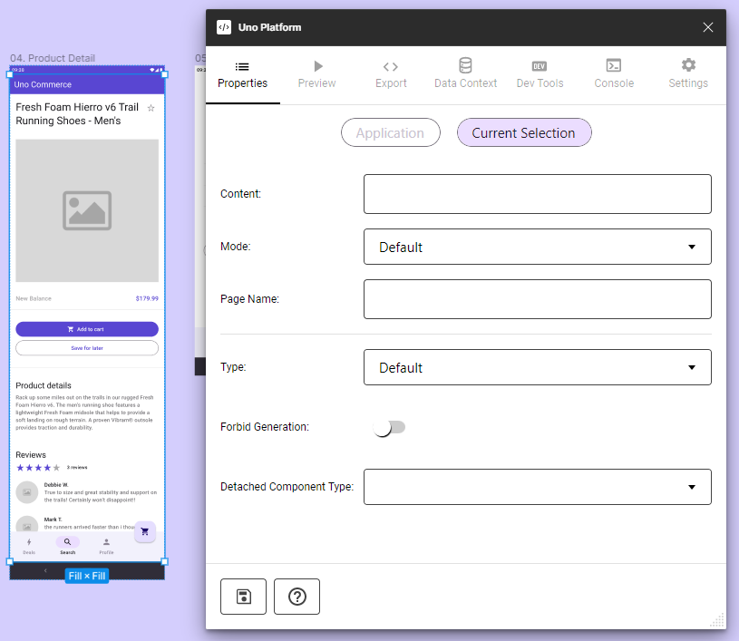
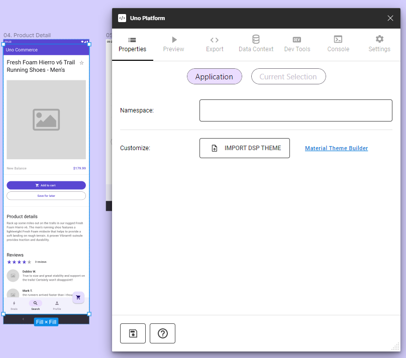

# Properties Tab

## Using the Properties Tab

Properties tab allows you to set metadata on Figma components used to drive to XAML generation.

It could also be used to set bindings to a component that can be used when the *Bindings* is toggled to ON in the settings tab.

> [!NOTE]
> Any changes in the properties tab must be saved, via the button at the bottom of the tab, to take effect.

### Properties notes

- *Content Field* allows to set Bindings for the selected component instance.
  > [!NOTE]
  > The format for the binding is `{BindingExpression}`. For example, setting the value `{Name}` on a Text Element in Figma will be translated into XAML like this:
  > ``` xml
  > <TextBlock Text="{Binding Name}" />
  > ```

- Mode:

  - *Static* mode: this means the data will be present directly in the DataContext of the generated page;

  - *Reactive* mode: this means the `Feeds` of Uno.Extensions.Reactive will be used to manage the availability of the content.

    > [!NOTE]
    > When using _Reactive_ mode, the `<FeedView>` component will be present in exported XAML, but never in the preview. The corresponding setting must be turned on for this generation to contains the FeedView control.

- *Page Name*: the exported page will receive this name instead the frame name.  

- *Type* allows you to assign Page, UserControl, ListView and Items Repeater (StackLayout) behaviours to a frame;

    > [!NOTE]
    > When you select the Type of a root frame as User Control, the generated preview will show you exactly the content of your User Control. However, in the export tab, the plugin will create the correct Xaml reference to your User Control and also include an option to view only your User Control content code in the Preview combobox. 


    > [!NOTE]
    > To add scrollable feature to a frame, start by going to the *Prototype tab* (in the top right of the Figma interface) and then set the **Overflow scrolling** property to one of the 4 options
    > - No scrolling
    > - Horizontal scrolling
    > - Vertical scrolling
    > - Horizontal and vertical scrolling
    
    > [!NOTE]
    > It is expected to have a result very close to Figma file design, when using ListView or Items Repeater options.
    > The use of each control depends on the goal of the developer. For more information about how Items Repeater works and its differences from ListView, please refer to [this article](https://docs.microsoft.com/en-us/windows/uwp/design/controls-and-patterns/items-repeater).

- *Custom Component*: custom component properties. Please see [Custom Components](custom-components.md): 

- *Application Namespace*: this property is used to prefix the _namespace_ in the generated XAML.

- *Customize*: used to import and override theme packages from Material Theme Builder and its property can be used to override the theme package used in the Figma File, for more information please visit the [Themes](../designers/themes.md) page.

> [!NOTE]
> Refer to Individual component documentation for their properties settings in the plugin.

### Steps to use the Properties tab

1. Select the page or component you wish to assign properties to;
2. From Figma's *Plugins* menu select *Uno Platform*;
3. Click the Properties tab (first one from the left);
4. Input changes;
5. Click the *Save* button at the bottom of the tab;
6. (Optional) Preview the effects either in the Preview or Export tabs by clicking the desired tab and then clicking the *Refresh* button at the bottom of the tab.

 
 

